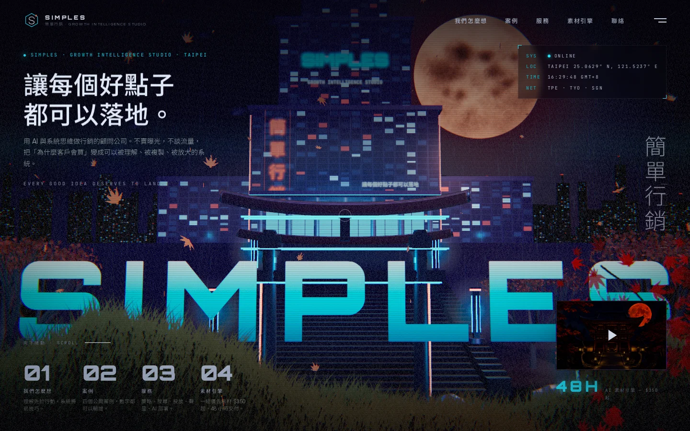

# Simples — 賽博朋克版首頁

簡單行銷 Simples 的新版單頁首頁：一座賽博朋克企業總部高塔，用 Three.js 即時渲染，隨著頁面捲動走過六個章節——我們怎麼想、案例、服務、AI 素材引擎、聯絡、頁尾。

本專案改寫自 [Kage](https://github.com/MengTo/kage)（京都山寺夜行的 WebGL 設計研究），保留原本的鏡頭路線、前景圖層、布料卡片與後製管線，把寺廟換成企業高塔、把朱紅換成青色霓虹與珊瑚橘招牌，內容則全部改為 [simples.com.tw](https://simples.com.tw/) 的服務與公司介紹。



## 這一頁有什麼

- **即時 3D 場景**：三層退縮的玻璃帷幕高塔（每扇窗都是程式生成的貼圖）、霓虹門、燈柱、珊瑚色月亮、有燈火的城市天際線、雨、霧、數據光點、頂樓航空警示燈。
- **公司招牌**：塔身掛著「簡單行銷」直排霓虹、SIMPLES 字標與「讓每個好點子都可以落地」，全部是 canvas 文字貼圖，會像真的霓虹一樣偶爾閃爍。
- **六個章節**：捲動驅動一條連續鏡頭路線，每個章節有自己的前景剪影圖層。
  - 01 我們怎麼想：品牌主張、三個核心理念、四個關鍵數字、六條原則跑馬燈。
  - 02 案例：三個即時視窗卡片（可互動的布料效果）加四個公開案例列表。
  - 03 服務：五個服務的圖版與三種合作方式。
  - 04 AI 素材引擎：5 切角 × 3 版本的生產線矩陣（會逐格點亮）、成效數字、五個方案價格、六步流程。
  - 05 聯絡：30 分鐘對話的三個步驟與 CTA。
- **賽博朋克後製**：掃描線、色差、泛光、紫色暗部與珊瑚色亮部的調色、雜訊顆粒、一道慢速掃過畫面的光帶。
- **HUD**：首頁右上角顯示台北座標與即時時間（GMT+8）。
- **中文標題逐字揭示**：依中文標點切句，句內不斷行。
- 保留原本的章節導覽、手機版選單、進度軌、自訂游標、減少動態模式與無 WebGL 時的靜態備援。

## 技術

一個 `index.html` 就是整個網站：文件結構、CSS、程式化場景建構、捲動編排與互動邏輯都在裡面。內附的 Three.js r149 提供 WebGL，沒有打包工具、沒有框架。

字型：Noto Sans TC（中文內文與標題）、Orbitron（英文字標）、JetBrains Mono（技術標籤），從 Google Fonts 載入；`secret-pathways-assets/fonts.css` 內嵌的 Onest 子集則供英文內文使用。

## 本機執行

在專案根目錄執行：

```bash
python3 -m http.server 4173 --bind 127.0.0.1
```

打開 [http://127.0.0.1:4173/](http://127.0.0.1:4173/)。

網址參數（除錯用）：`?shot=0`～`?shot=6` 直接跳到某個章節並關閉入場動畫；`?q=low` 低畫質；`?post=0` 關閉後製；`?nogl=1` 強制靜態備援。

## 專案結構

```text
kage/
├── index.html                 整個網站
├── INTEGRATION.md             與 simples.com.tw 現有 WordPress 站的整合計畫
├── PROMPT.md                  可移植的建置說明（重建或再詮釋這個體驗）
├── README.md
├── assets/
│   └── simples-preview.webp
└── secret-pathways-assets/
    ├── fonts.css              Onest 子集
    ├── three.min.js           Three.js r149
    ├── generated/             案例卡片與預覽視窗使用的場景圖
    └── foreground/png/        前景剪影圖層
```

## 內容來源與授權

頁面上的公司介紹、服務、案例數字、方案價格與聯絡資訊皆取自 [simples.com.tw](https://simples.com.tw/)，更新時請以官網為準；`INTEGRATION.md` 說明了哪些區塊對應到官網的哪些頁面。

場景圖與前景圖層沿用 Kage 專案的生成素材；原始 Kage 程式碼與素材未授權再散布，Three.js 依其 MIT 授權使用。
